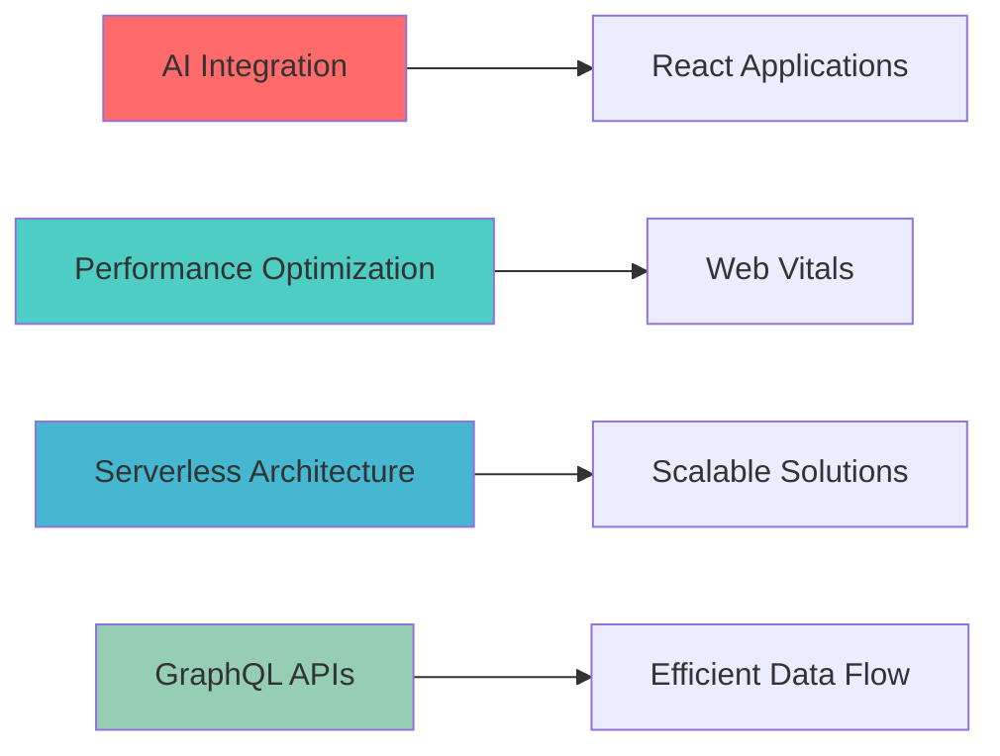

<div align="center">
  
# 💫 Zahid Hussain | React.js Architect


[](https://www.linkedin.com/in/zahid-hussain-850a80175/)
[](https://vercel.com/zahid-hussains-projects-64d62113)
[](mailto:contact@zahidhussain.dev)


</div>

---

## 🚀 **Full-Stack Developer & Solution Architect**

> *Transforming complex business requirements into scalable, high-performance web applications with 3+ years of expertise in modern JavaScript ecosystem*

```javascript
const zahidHussain = {
    role: "React.js Architect",
    experience: "3+ years",
    languages: ["English", "Urdu", "Pashtu"],
    
    expertise: {
        frontend: ["React.js", "Next.js", "TypeScript", "Svelte"],
        backend: ["Node.js", "Express.js"],
        databases: ["MongoDB", "MySql"],
    },
    
    currentFocus: "AI-Driven Web Applications & Performance Optimization",
    philosophy: "Clean Code. Scalable Architecture. User-Centric Design."
};
```

---

## 🛠️ **Technology Arsenal**

<div align="center">

### **Frontend Mastery**


### **Styling & UI**


### **Backend & Database**


### **DevOps & Tools**


</div>

---


## 📊 **Performance Metrics**

<div align="center">


</div>

---

## 🎯 **Current Focus & Innovation**

<div align="center">



</div>

**📚 Knowledge Sharing:**
- Mentoring junior developers

---

## 🌟 **Professional Philosophy**

<div align="center">

> *"Excellence in software development isn't just about writing code—it's about crafting solutions that scale, perform, and delight users while maintaining architectural integrity."*


</div>

---

## 📈 **GitHub Activity Graph**

<div align="center">

[](https://github.com/ashutosh00710/github-readme-activity-graph)

</div>

---

## 🤝 **Let's Build Something Amazing Together**

<div align="center">

**🚀 Available for  React.js positions and enterprise consulting**

[](https://www.linkedin.com/in/zahid-hussain-850a80175/)
[](https://vercel.com/zahid-hussains-projects-64d62113)
[](mailto:contact@zahidhussain.dev)


**💡 "Code is poetry written for machines to understand and humans to admire."**


</div>
### 📸 About Me 
[](https://postimg.cc/zHyy1J6F)

---

Thanks for visiting my profile! Feel free to explore my repositories or reach out to collaborate. 🚀
