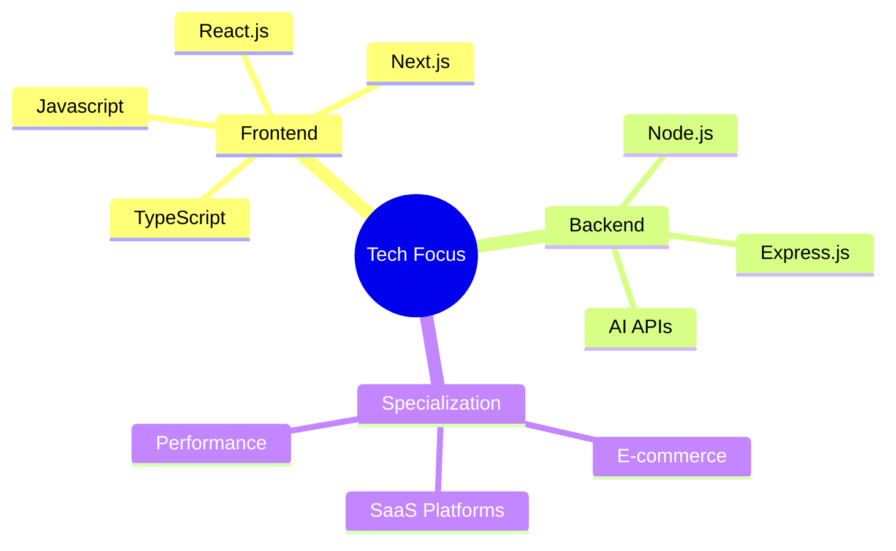
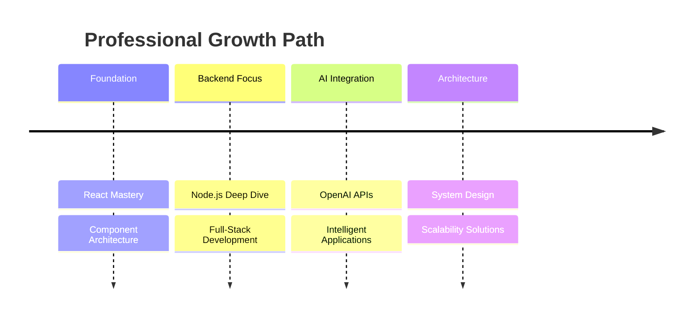

<div align="center">
  
# 💫 Zahid Hussain | React.js Architect


[](https://www.linkedin.com/in/zahid-hussain-850a80175/)
[](https://vercel.com/zahid-hussains-projects-64d62113)
[](mailto:zahid.husyn.dev@gmail.com)


</div>

---

## 🚀 **Frontend Developer & Solution Architect**

> *Transforming complex business requirements into scalable, high-performance web applications with 3+ years of expertise in modern JavaScript ecosystem*

```javascript
const zahidHussain = {
    role: "React.js Architect",
    experience: "3+ years",
    languages: ["English", "Urdu", "Pashtu"],
    
    expertise: {
        frontend: ["React.js", "Next.js", "TypeScript", "Svelte"],
        backend: ["Node.js", "Express.js"],
        databases: ["MongoDB", "MySql"],
        stylings: ["TailwindCSS", "Bootstrap", "MaterialUI", "Styled-Components", "SASS]
    },
    
    currentFocus: "AI-Driven Web Applications & Performance Optimization",
    philosophy: "Clean Code. Scalable Architecture. User-Centric Design."
};
```

---

## 🛠️ **Technology Arsenal**

<div align="center">

### **Frontend Mastery**


### **Styling & UI**


### **Backend & Database**


### **DevOps & Tools**


</div>

---

## 🎨 **Featured Project Showcase**

<div align="center">

### **🏢 Modern Enterprise Designs**

<table>
<tr>
<td width="33%">
<h4>📊 Admin Dashboard</h4>

<p><em>Comprehensive admin panel with advanced analytics</em></p>
</td>
<td width="33%">
<h4>🎯 Modern UI Landing Page</h4>

<p><em>Contemporary landing page design</em></p>
</td>
<td width="33%">
<h4>🛒 E-commerce Platform</h4>

<p><em>Modern e-commerce interface with seamless UX</em></p>
</td>
</tr>
</table>

### **💎 Lusso - Labs Creator Platform**

<table>
<tr>
<td width="20%">
<h4>🤖 Lusso landing Page</h4>

<p><em>Landing Page content creation</em></p>
</td>
<td width="20%">
<h4>📅 Schedule/Publish/Auto Posts</h4>

<p><em>Advanced scheduling system</em></p>
</td>
<td width="20%">
<h4>✍️ Content Creation</h4>

<p><em>Selecting dates for Scheduling Posts </em></p>
</td>
<td width="20%">
<h4>🎯 Creator Onboarding</h4>

<p><em>Streamlined onboarding</em></p>
</td>
<td width="20%">
<h4>⚙️ Settings Panel</h4>

<p><em>Comprehensive settings</em></p>
</td>
</tr>
<tr>
<td colspan="5" align="center">
<h4>🔐 Authentication System</h4>

<p><em>Secure authentication with modern design</em></p>
</td>
</tr>
</table>

### **🤝 Sharek - KFU Management System**

<table>
<tr>
<td width="20%">
<h4>🚪 Login Interface</h4>

</td>
<td width="20%">
<h4>📊 Dashboard Overview</h4>

</td>
<td width="20%">
<h4>📧 Inbox Management</h4>

</td>
<td width="20%">
<h4>📈 Referral Analytics</h4>

</td>
<td width="20%">
<h4>🔍 Advanced Search</h4>

</td>
</tr>
</table>

### **🎯 GIG Admin Portal**

<table>
<tr>
<td width="25%">
<h4>📈 Main Dashboard</h4>

</td>
<td width="25%">
<h4>📊 Analytics View</h4>

</td>
<td width="25%">
<h4>📋 Policy Management</h4>

</td>
<td width="25%">
<h4>💼 B2B Dashboard</h4>

</td>
</tr>
</table>

### **💰 KFund - Kuwait Fund**

<table>
<tr>
<td width="25%">
<h4>📊 Dashboard</h4>

</td>
<td width="25%">
<h4>👥 Groups Management</h4>

</td>
<td width="25%">
<h4>👤 User Management</h4>

</td>
<td width="25%">
<h4>📋 Request Handling</h4>

</td>
</tr>
</table>

### **📚 Educational Solutions**

<table>
<tr>
<td width="25%">
<h4>💰 Cryptocurrency Tracker</h4>

<p><em>Real-time crypto market tracking</em></p>
</td>
<td width="25%">
<h4>🎓 EducatoBox Platform</h4>

<p><em>Interactive learning platform</em></p>
</td>
<td width="25%">
<h4>📖 Learning Dashboard</h4>

<p><em>Student assessment system</em></p>
</td>
<td width="25%">
<h4>⛽ Gaskon Platform</h4>

</td>
</tr>
</table>

**🏆 Project Highlights:**
- **Enterprise-Grade Solutions** with scalable architecture
- **AI-Powered Features** and intelligent automation
- **Real-time Analytics** and comprehensive dashboards
- **Multi-tenant SaaS Platforms** with role-based access
- **Modern UI/UX Design** with responsive layouts
- **Secure Authentication** and authorization systems
- **Performance Optimized** applications with 99.9% uptime
- **Cross-platform Compatibility** and mobile responsiveness

</div>

---

## 📊 **Performance Metrics**

<div align="center">


</div>

---

## 🎯 **Current Focus & Innovation**

<div align="center">

### **🛠️ Tech Stack Focus**


### **📈 Learning Timeline**


</div>

**🔥 Active Learning Path:**
- **Backend Ecosystem:** Node.js, Express.js, GraphQ
- **AI Integration:** OpenAI APIs, intelligent user experiences
- **Performance Engineering:** Bundle optimization, lazy loading strategies, SSR/SSG implementations

**🏗️ Architecture Focus:**
- Designing scalable e-commerce solutions with 99.9% uptime
- Building multi-tenant SaaS platforms with role-based access
- Legacy system modernization and performance bottleneck resolution

**📚 Knowledge Sharing:**
- Mentoring junior developers

---

## 🌟 **Professional Philosophy**

<div align="center">

> *"Excellence in software development isn't just about writing code—it's about crafting solutions that scale, perform, and delight users while maintaining architectural integrity."*


</div>

---

## 📈 **GitHub Activity Graph**

<div align="center">

[](https://github.com/ashutosh00710/github-readme-activity-graph)

</div>

---

## 🤝 **Let's Build Something Amazing Together**

<div align="center">

**🚀 Available for  React.js positions and enterprise consulting**

[](https://www.linkedin.com/in/zahid-hussain-850a80175/)
[](https://vercel.com/zahid-hussains-projects-64d62113)
[](mailto:zahid4307@gmail.com)


**💡 "Code is poetry written for machines to understand and humans to admire."**


<div align="center">

**🎯 Ready to bring your vision to life?**

[](mailto:zahid4307@gmail.com)
[](https://github.com/zahidhussain123?tab=repositories)


</div>

---

Thanks for visiting my profile! Feel free to explore my repositories or reach out to collaborate. 🚀
